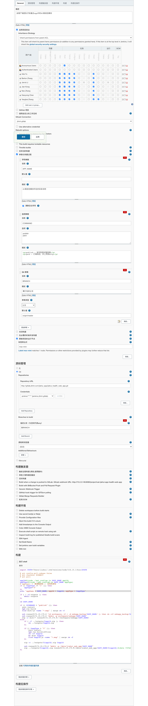

### jenkins shell 脚本命令



```bash
export PATH=/Users/jiahui/.nvm/versions/node/v16.15.1/bin:$PATH

# git config pull.rebase false
# git checkout $COMMIT
# git pull

appId=$(node ./get_configs.js $APP_NAME appId)
appType=$(node ./get_configs.js $APP_NAME appType)
# appType: 0：普通离线包 1：全局资源包
if [[ $appType != "1" ]]; then
    appType="0"
fi
echo "appName = $APP_NAME, appId = $appId, appType = $appType"

if [ ! -d outputs ]; then
    mkdir outputs
fi

cd $APP_NAME

if [[ $COMMAND = "publish" ]]; then
  yarn install
  npm run build
  find dist/js -name "*.map" | xargs rm -f
  
  ssh runner@172.19.170.8 "cd workspace; if [ -d webapp_backup/$APP_NAME/ ]; then rm -rf webapp_backup/$APP_NAME; fi; if [ -d webapp/$APP_NAME ]; then mv webapp/$APP_NAME webapp_backup/; fi"
  ssh runner@172.19.170.8 "mkdir -p workspace/webapp/$APP_NAME"
  scp -r dist/* runner@172.19.170.8:~/workspace/webapp/$APP_NAME/
else
	if [ -f ../outputs/$appId.zip ]; then
    	rm ../outputs/$appId.zip
    fi

	if [[ $appType = "0" ]]; then
    	yarn install
        npm run build:offline
        rm -rf $appId
        mv dist $appId
    	find $appId/js -name "*.map" | xargs rm -f
	fi
    
    zip -r ../outputs/${appId}.zip $appId
    
    ssh runner@172.19.170.8 "mkdir -p /data/jiahui_web_app/$APP_NAME"
    scp ../outputs/${appId}.zip runner@172.19.170.8:/data/jiahui_web_app/$APP_NAME/${appId}-$(date +%Y%m%d%H%M%S).zip
fi
```