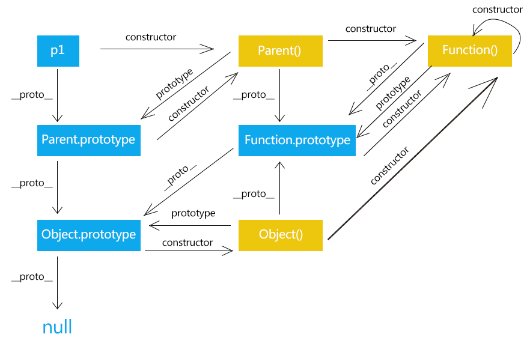

# 原型链

## 背景
  * `__proto__`, **constructor** 对象独有的。
  * **prototype**函数独有的。函数作为特殊的对象，所有也存在`__proto__`, **constructor**属性。
  * 实例的`__proto__` 对应构造函数**constructor**的原型对象`__proto__`;

:::warning
  Object.prototype.__proto__ === null

  对象的原型实例对象为V8引擎创建出来的，刻意为之，否则可能引起原型链循环引用。
  
  所以原型的祖先从这里结束
:::

## 原理
:::tip
实例的__proto__属性指向构造函数的prototype对象。

**`obj.__proto__ === Object.prototype`**

子类的继承原理, 函数的原型对象的

Object.prototype === Function.prototype.__proto__;

:::

## 原型链图
  
  const fun = function() {};

## 继承
### Object篇
```js
  const obj = {};
  Object.prototype.__proto__ === null
  Object.__proto__ === Object.constructor.prototype;
  Object.constructor === Function === Function.constructor;
  Object.__proto__ === Function.prototype === Function.__proto__; // 后面证明了
  Object.prototype === Function.prototype.__proto__ === Function.__proto__.__proto__;
  // 原型继承，实例直接修改原型对象的值或者构造函数的原型对象修改值都可以继承
  Object.__proto__.age = 18; => 实例直接给[[prototype]]赋值  <=> Function.prototype.age === 19;
  // 通过字面量创建的对象obj
  obj.__proto__.sex = 'M' => Object.prototype.sex => 'M' => Function
  // Object.__proto__ === Function.prototype


  // 总结
  1.实例的__proto__ 等于构造函数的prototype
  2.Object.__proto__ === Function.prototype Object可以看作是Function的实例对象。
  3.Object.prototype.__proto__ === null, 是一个对象， 这个对象的原型实例对象为V8引擎创建出来的，刻意为之，否则可能引起原型链循环引用。
  4.Object 的构造函数为Function,而对象的实例[[prototype]]对象等于构造函数的prototype => Object.__proto__ === Function.prototype

```
### Function篇
```js
  // Object.prototype.__proto__ === null
  1. Object.prototype.__proto__ === null // 对象的原型实例对象为V8引擎创建出来的，刻意为之，否则可能引起原型链循环引用。
  // 实例的__proto__ 等于构造函数的prototype
  Object.__proto__ === Object.constructor.prototype;
  Object.constructor === Function === Function.constructor;
  Object.__proto__ === Function.prototype === Function.__proto__; // 后面证明了
  Object.prototype === Function.prototype.__proto__;
  // 

```

  * `Object.prototype.__proto__ === null`;
    * 对象的原型实例对象为V8引擎创建出来的，刻意为之，否则可能引起原型链循环引用。
  * `Object.constructor === Function`;
  * `Object.__proto__ === Function.__proto__`;
  * `Object.__proto__ === Function.prototype`;
  * `Object.prototype === Function.prototype.__proto__`;
  * `Object.prototype === Function.__proto__.__proto__`;
  * `Object.prototype.constructor === Object`;
  * 
    * 对象的构造函数为Function。
    * 每个对象都有一个__proto__属性，该属性指向一个对象。
    * 对象的原型对象为函数的原型的实例
  

## 继承

## 证明: **`Function.__proto__ === Function.prototype`**;
  
```js
  // 因为上面说的原理: 实例的__proto__ === 实例的构造函数的.prototype
   => Object.__proto__ === Object.constructor.prototype
   => Function.__proto__ === Function.constructor.prototype
   => Function.constructor === Function
   => Function.__proto__ === Function.constructor.prototype
   => Function.__proto__ === Function.prototype

```

## 证明: **`Object.__proto__ === Function.prototype === Function.__proto__`**;
  
```js
  => Object.__proto__ === Object.constructor.prototype;
  => Object.constructor === Function === Function.constructor;
  => Object.__proto__ === Function.prototype === Function.__proto__; 

  // 所以
  => Object.__proto__.__proto__ === Function.prototype.__proto__.
```

## 证明: **`Object.prototype === Function.prototype.__proto__`**;
  
```js
  这是继承的关键
  => Object === Object.prototype.constructor;

```

## 函数对象与普通对象

```bash
  // 函数对象 js内置的函数对象
    Boolean.prototype.constructor === Boolean;
    true
    String.prototype.constructor === String;
    true
    Date.prototype.constructor === Date;
    true
    Number.prototype.constructor === Number;
    true
    Array.prototype.constructor === Array;
    true
    Object.prototype.constructor === Object;
    true
    Function.prototype.constructor === Function;
    true
    RegExp.prototype.constructor === RegExp;
    true
  // 普通对象
```

## 函数实例的继承

```bash
  const func = function() {};
  func.__proto__ === Function.prototype;
  func.__proto__ === Function.__proto__;
  func.__proto__.__proto__ === Function.prototype.__proto__ === Object.__proto__.__proto__;
  func.__proto__.__proto__  === Object.__proto__.__proto__;
```

## 对象实例的继承

```bash
  const obj = {};
  obj.__proto__ === Object.prototype;
  obj.__proto__ === Function.prototype.__proto__;
```

## 实例理解

```javastript
  // 例1
  const o = {};
  const func = {};
  Object.prototype.name = '隔壁王叔叔';

  console.log(o.name);  // 隔壁王叔叔
  console.log(o.__proto__.name);  // 隔壁王叔叔
  console.log(fun.prototype.__proto__.name); // 隔壁王叔叔
  console.log(Function.prototype.__proto__.name); // 隔壁王叔叔

  // 例子2
  Function.prototype.age = 19;
  console.log(o.age);  // 19
  console.log(o.__proto__.age);  // 19


```
  